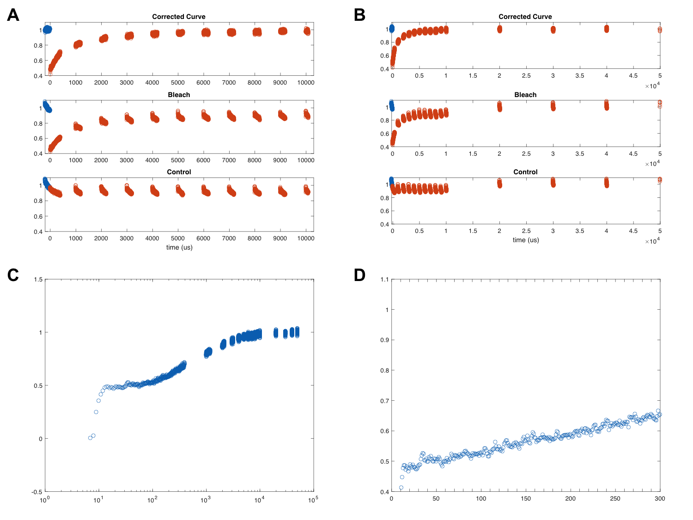
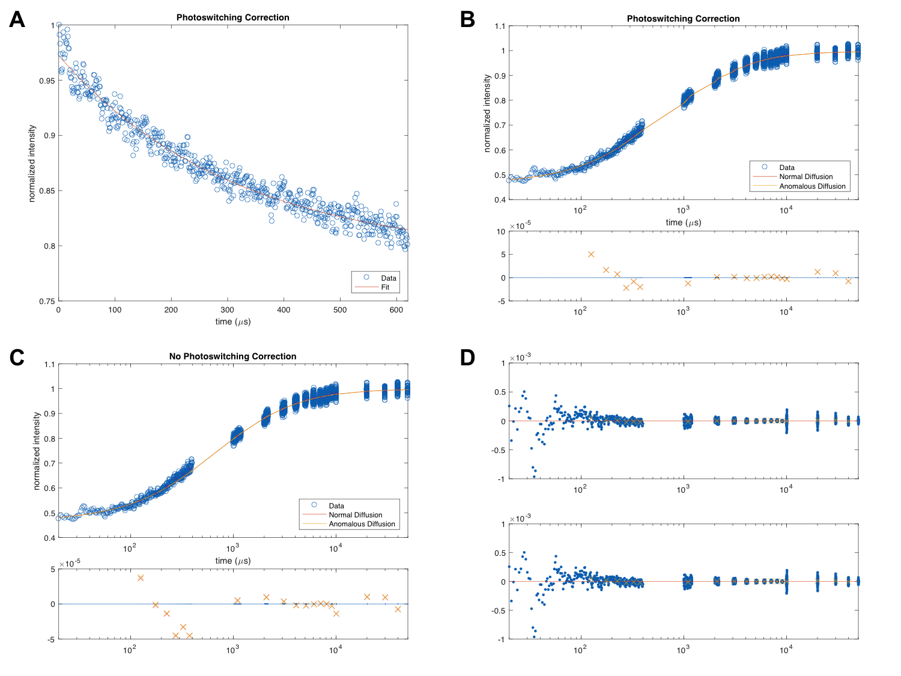

# Point FRAP Fitting
The **Point FRAP Fitting** program is a collection of Matlab scripts to analyze and fit diffraction limited point FRAP data. The analysis takes raw FRAP outputs in the form of voltages which are normalized, averaged, and saved. The saved FRAP curves are fit to a FRAP model to extract the diffusion parameters as measured by FRAP. 

#### Reference
- For full details on the FRAP model and procedure see [Revisiting point FRAP to quantitatively characterize anomalous diffusion in live cells](https://doi.org/10.1021/jp310348s). 
- For an example application and the use of the distribution model see [RNA polymerase II subunits exhibit a broad distribution of macromolecular assembly states in the interchromatin space of cell nuclei](https://doi.org/10.1021/jp4082933).

## Files in the repository
- `loadandfit_2model.m` The main script. Runs all of the scripts below. 
- `pointb.m` or `pointb_smallfile.m` Processes the FRAP data and place the voltages on the proper time axis. Choosing the correct file depends on the input data. 
- `FRAPfitweightedpsc_2model.m` Fits the FRAP data to a FRAP model. It is dependant on the functions below.  
    - `meanvals2.m`
    - `ptFRAP.m`
    - `ptFRAPpsc.m`
    - `ptFRAPpscweighted.m`
    - `ptFRAPweighted.m`
- `savetable_2model.m` Saves the best fit parameters to a text file for importing into Excel for further analysis. 
- `Example.mat` Example data set for running the program. 

## Running the software
The `loadandfit_2model.m` script contains the variables to be configured to run the FRAP fitting analysis. The `data_filename` is set to the .mat file (omitting the extension) that contains the FRAP data. 

```matlab
data_filename = 'Example';
```

The `start` variable is set to the number of data points (or microseconds) after the bleach that the fit begins. This is usually set to a value between 20 to 80. The early time data is subject to ringing in the preamplifer due to the bleaching intensity. For more details see Figure S2 in [this reference.](https://doi.org/10.1021/jp310348s)

```matlab
start = 20;
```

The `wr` (radial) and `wz` (axial) variables are set to the [1/e^2 beam diameter](https://en.wikipedia.org/wiki/Beam_diameter#1.2Fe2_width) of the focused [point spread function](https://en.wikipedia.org/wiki/Point_spread_function) of the microscope in micrometers (μm). These values are acquired by measuring the point spread function using subdiffractive fluorescent beads. 

```matlab
wr = 0.325; %1/e^2 radius in um 
wz = 0.974; %1/e^2 radius in um 
```

The `x0` variable is set to the initial guess for the fitting algorithm. If the resulting fits are poor adjust this variable to the best known information. 

```matlab
x0 = [80 1 1];  %initial guess [D (or G) alpha F t=inf]  
                %the inital guess for F t=0 is supplied by the script
```

Finally, `calci` determines if the 95% confidence intervals are calculated (1 = yes, 0 = no). The script runs faster if the confidence intervals are not calculated. It is useful to turn off the confidence intervals when optimizing the fitting parameters. 

```matlab
calci = 1;  % Is the 95% confidence interval calculated? (1 = Yes; 0 = No)
            % Not calculating the 95% CI speeds up the fitting 
```

Running the script after the parameters are set will generate the output described below. 

## Output
The script generates 8 figures and a tab seperated (.tsv) file with all of the fitting parameters. The figures below describe the output figures and table. 


**Figure 1:**  Pre-fitting figures. (A) Output Figure 1. This figure plots the raw data of the bleach and control curves. Careful examination of these curves is necessary to ensure that the FRAP recovery is a real event and not an artifact of the observational photobleaching correction as explained in [reference (see Figure 3)](https://doi.org/10.1021/jp310348s). (B) Output Figure 2. Same data as shown in panel A except the time axis is changed to include the long time points. (C) Output Figure 3. This is the entire FRAP curve plotted on logarithmic time axis in microseconds (μs).  The plot is used to check, before fitting, if the curve looks qualitatively acceptable. (D) Output Figure 4. This figure plots the first 300 μs after bleach on a linear time axis. This plot is used to check of ringing of the preamplifier as explained in [reference (see Figure S2)](https://doi.org/10.1021/jp310348s).  


**Figure 2:** Post-fitting figures. (A) Output Figure 10. This figure shows the first 620 μs of the control curve and is fit to an exponential decay to determine τPP and δ used in photoswitching correction model. (B) Output Figure 12. The FRAP data are fit using the photoswitching correction model [(reference Eq. 6)](https://doi.org/10.1021/jp310348s) with the anomalous parameter fixed to 1 (Normal Diffusion, red line) or allowed to float (Anomalous Diffusion, orange line). The bottom plot shows the averaged residuals of each of the fits. (C) Output Figure 13. Same data and color scheme as in B except data are fit using  the model without the correction for photoswitching [(reference Eq. 4)](https://doi.org/10.1021/jp310348s). (D) Output Figure 14. This figure plots the raw, un-averaged residuals from the fits in panel B. The top plot shows the residuals from the Normal Diffusion fit and the bottom shows the residuals from the Anomalous Diffusion fit.


**Table 1:** Example output table (Example_.tsv). Since the output is plain text the name of Greek variables are used in place of their symbols (e.g. Tau instead of τPP, the photophysics decay constant).  Additionally, F t=0 refers to the bleach depth (the fluorescence at time 0), and F t=inf refers to the final fluorescence intensity (the fluorescence at time infinity).  A value of F t=inf that is less than ~1 indicates the presence of an immobile fraction.  RN is the squared 2 norm of the residual.  BIC and BIC% are the BIC score and percentage of model likelihood respectively [(reference: Materials and Methods section 4)](https://doi.org/10.1021/jp310348s).  Low and High F0 refer to the lower and upper bounds placed on the bleach depth as a replacement for early time points as described in [reference (Supporting Information)](https://doi.org/10.1021/jp310348s). 

## License
This software is made available under the [MIT License](LICENSE). 
